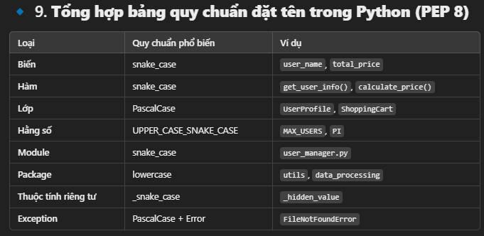

Tham khảo: https://github.com/logpai/logparser/tree/main/logparser/Drain

2. Ta thử thực hiện kế thừa và in ra các log Drain, sau đó cho chạy train để thực hiện xem thằng Brain.

Quy chuẩn đặt tên được viết lại thông qua file Drain_test.py

Quy chuẩn đặt tên:

Kết quả rút ra: 
- HDFS_v1: Tổng số dòng log: 11175629
